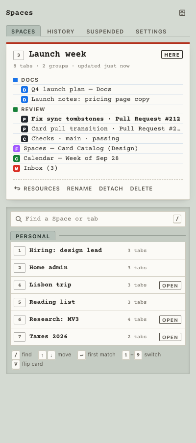
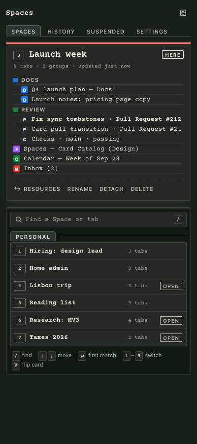
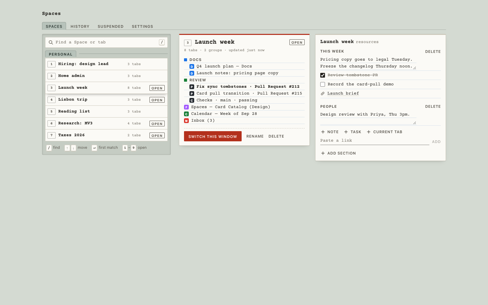

# Spaces

**[⬇ Download Spaces for Mac (.dmg)](https://github.com/bhagathon/spaces-by-bhag/releases/latest/download/Spaces-1.4.1.dmg)** · [All releases](https://github.com/bhagathon/spaces-by-bhag/releases)

<p>
  
  
</p>



*Screenshots use synthetic demo tabs.*

A personal Chrome extension for switching between saved tab contexts ("Spaces"), in the style of Workona. It's for my own use and isn't published anywhere.

## Install

**On a Mac (easiest):** download `Spaces-<version>.dmg` from the latest GitHub release, open it, and run **Install Spaces**.
- The first time, macOS may warn that the app is from an unidentified developer. Right-click it, choose **Open**, then **Open** again.
- Chrome then needs one confirmation (Developer mode, then Load unpacked). The installer opens the page and copies the folder path for you.
- After that, updates are automatic. A background task checks Google Cloud Storage at login and every 6 hours, verifies the download's checksum, and swaps in the new files. The extension notices and reloads itself within 10 minutes.
- To update right away, use **Settings → Updates → Update now**. It shows the installed and latest versions, and asks the same updater to run immediately through a small Chrome native messaging helper that the installer registers. Every check is logged in `~/Library/Logs/Spaces-updater.log`.

**From source:**

```bash
npm install
npm run build          # outputs dist/
```

Then go to `chrome://extensions`, turn on Developer mode, click **Load unpacked**, and choose `dist/`.
You can also skip the build: download `spaces-extension-<version>.zip` from the latest GitHub release, unzip it, and load that folder.
Clicking the toolbar icon opens the side panel. Cmd+Shift+S (Ctrl+Shift+S on Windows/Linux) opens the full dashboard.

## Design

The UI is a card catalog. Each Space is a typed index card in a drawer. The Space in this window is the card pulled up, and the rest are card tops you flick through. Red is used for one thing only: pulling a card, which is switching. See `DESIGN.md` for the system, and `PRODUCT.md` for who it's for.

Keys (side panel):

| Key | Action |
|---|---|
| `/` or `⌘K` | Find a Space or tab |
| `↑` `↓` | Move through the drawer |
| `↵` | Take the first match |
| `1`–`9` | Switch to that card |
| `V` | Flip the card to its resources |
| `⌃S` (Control+S) | Show or hide the side panel |
| `⌥⇧S` | Open the side panel |
| `⌘⇧S` | Go to this window's home tab (or open the full catalog) |
| `⌘+` `⌘−` `⌘0` | Panel text size: bigger, smaller, default |

## Features

- **Spaces.** Save a window as a Space and switch between Spaces. A switch saves the outgoing tabs, opens the incoming ones, closes the old ones, then restores tab groups and the active tab. The window is never left empty. If a switch fails partway through, it's rolled back.
- **New tabs ask first.** A tab you open in a Space window isn't added to the Space until you say so. The panel shows "Add to <Space>?" for 2 seconds, paused while you point at it. The card keeps listing "Not in this Space" tabs, and the toolbar badge counts them. Tabs you don't add close on the next switch; History keeps a copy.
- **Edit mode.** Edit on a card sets its color, reorders or removes its tabs, and holds Rename and Delete. For a Space open in a window, edits act on the real tabs. A Space's color shows as a swatch by its name and colors its tab group.
- **Lazy loading.** After a switch, background tabs are discarded right away, so each one loads only when you click it.
- **Pinned tabs.** They stay in place across all Spaces (you can turn this off in Settings).
- **Space tab group (off by default).** When turned on in Settings → Switching, a window's loose tabs sit in a Chrome tab group named after its Space, in a colour that stays the same for that Space. Tabs in groups you made stay in them (Chrome can't nest groups), and the group never reorders tabs: a tab only joins it when it's already next to it. The group is never saved into the Space. It follows renames, and disappears when you detach the window or delete the Space.
- **Home tab.** Every Space window gets the Spaces dashboard as a pinned first tab, like Workona's. Switching never closes it, and it isn't saved into the Space. Its layout follows the tab's width: one column when narrow, the agenda above the drawer at mid widths, and three columns (drawer, card, agenda) on wide screens. If you close it, it comes back on the next switch. You can turn it off in Settings → Switching.
- **Google Calendar (optional).** A **Today** view (next to Spaces, History and Suspended) lists today's events. They also appear on the home tab, with a NOW stamp and a Join link for video calls, and the current or next meeting (within the hour) at the top of the panel. It's read-only and uses your own OAuth client: Settings → Google Calendar lists the steps and shows the redirect URI to register. Events are fetched from Google each time and never stored or synced. The access token lives in session storage and renews silently while you're signed in to Google.
- **Auto-save.** Tab changes are written to the window's Space after 1.5 s. Closing a window does not empty its Space.
- **Suspender.** Every minute, background tabs that haven't been viewed for N minutes are discarded. Pinned tabs, tabs playing audio, and sites on the never-suspend list are skipped. When memory is low, the threshold drops to 5 minutes.
- **History.** A snapshot of each window is stored every minute, but only when its tabs changed. Snapshots are kept for 30 days. Restoring one opens it as a new Space.
- **Resources.** Each Space has sections of notes, checklists and saved links (the "Current tab" button saves the page you're on). Edits save as you type.
- **Sync (optional).** Spaces and resources sync across devices through your own server (`server/`, runs on Cloud Run + Firestore). It's local-first: everything reads from IndexedDB and works offline, and writes queue in an outbox until the server accepts them.
  - By default the extension polls once a minute. "Live updates" switches to a WebSocket, which syncs instantly and shows which Spaces are open on your other devices.
  - Team workspaces support owner, editor and viewer roles, enforced by the server.
  - Conflicts: a Space open in a window keeps the window's tabs. For other Spaces, if two devices edit the same one, both versions are kept (one becomes a "conflict copy"). Resources are merged item by item.
  - History snapshots stay on each device and aren't synced.
- **Settings** open from the sliders button in the header, so the four views fit even Chrome's narrowest (320px) side panel.
- **Text size.** Settings → Display sets the side panel's text size: Small, Default, Large or Larger (90–130%). ⌘+ and ⌘− also change it in the panel. Everything scales together, so typed entries stay on their ruled lines. The dashboard follows Chrome's own zoom instead.
- **Backup.** Settings → Backup exports every Space and its resources to a JSON file. Import only adds Spaces you don't already have; it never overwrites or deletes. Deleting a Space shows an **Undo** for 10 seconds.
- **Safety rules learned from Tabox's issue tracker:**
  - Sync only deletes a Space when the server recorded the deletion (a tombstone). A Space merely missing from the server is re-uploaded, not deleted.
  - Changing the server or token resets sync bookkeeping, so it can't wipe local data.
  - Lazy-loaded tabs are only discarded once their URL has committed, so they never come back blank.
  - Outgoing tab groups are dissolved before a switch, so Chrome's Tab Groups menu doesn't fill with duplicates.
  - Windows restored after a crash re-attach to their Spaces, unless you had detached them.
  - Incognito windows are never snapshotted.
  - `javascript:` and `data:` URLs are never opened or linked.
- **Unsaved form protection (optional).** When turned on, a tab you've typed into (but haven't submitted) is never suspended. This asks for access to all sites. It only checks whether a field has text; it never reads or stores what you typed.

## Releasing

```bash
npm pkg set version=X.Y.Z                    # and the same "version" in static/manifest.json
PROJECT=<gcp-project> npm run publish-update # uploads the zip + latest.json; installed Macs update within 6h
npm run dmg                                  # release/Spaces-X.Y.Z.dmg for new installs
```

## Test

```bash
npm test               # unit tests (fake chrome.* + fake-indexeddb)
npm run typecheck
npm run e2e            # builds, loads dist/ into Playwright Chromium: switching, resources, sync against a live server, form guard, Space group + home tab, Update now
```

`chrome.tabs.discard()` crashes Playwright's Chrome for Testing 153.0.8010.12, even from a bare extension. Because of that, the e2e test skips the lazy-load and suspender checks unless you run it with `DISCARD=1`. Check those two features by hand in regular Chrome.

The server has its own README in `server/`, covering local runs, the GCP deploy, admin commands and the Firestore emulator tests.
